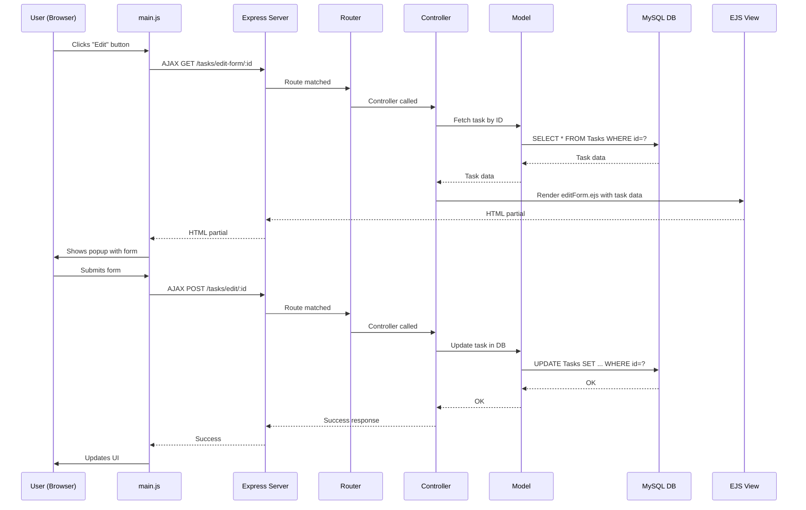

# MVC Flow Explained: To-Do App

This document provides a **detailed, step-by-step explanation** of how the MVC (Model-View-Controller) pattern works in your To-Do App, including diagrams and real project examples.

---

## What is MVC?

**MVC** stands for **Model-View-Controller**.  
It is a design pattern that separates your application into three interconnected components:

- **Model:** Handles data and business logic (database, CRUD operations).
- **View:** Handles the UI (what the user sees).
- **Controller:** Handles user input, processes requests, and coordinates between Model and View.

---

## 📊 High-Level MVC Flow Diagram

```FLOWCHART
------------------------>
    ROLES:

    User[User (Browser)]
    Route[Express Route]
    Controller[Controller (taskController.ts)]
    Model[Model (taskModel.ts)]
    View[View (EJS Templates)]
    DB[(MySQL Database)]

    SEQUENCE:

    User -- HTTP Request --> Route
    Route -- Calls --> Controller
    Controller -- Reads/Writes --> Model
    Model -- SQL Query --> DB
    DB -- Data --> Model
    Model -- Data --> Controller
    Controller -- Renders --> View
    View -- HTML --> User
```

---

## 🧭 Step-by-Step: Viewing Tasks

### 1. User Action

- The user visits `/tasks` in their browser.

### 2. Express Routing

- The request is received by the Express server (`src/server.ts`).
- The route `/tasks` is matched in `src/routes/taskRoutes.ts`.

### 3. Controller Logic

- The router calls the `list` function in `src/controllers/taskController.ts`.
- The controller:
  - Reads query parameters (filters, language, etc.).
  - Calls the model to fetch tasks.

### 4. Model Logic

- The controller calls `Task.getAll()` from `src/models/taskModel.ts`.
- The model executes a SQL query to fetch all tasks from the MySQL database.

### 5. Data Returned

- The model returns the list of tasks to the controller.

### 6. View Rendering

- The controller calls `res.render('tasks', { tasks, t, lang })`.
- The EJS template (`src/views/tasks.ejs`) receives the data and generates HTML.

### 7. Response

- The rendered HTML is sent back to the browser.
- The browser displays the tasks, styled by `main.css` and made interactive by `main.js`.

---

## 🧭 Step-by-Step: Adding or Editing a Task (AJAX/Popup)

### 1. User Action

- The user clicks the "+" button or an edit icon.

### 2. JavaScript (AJAX)

- `public/main.js` intercepts the click and sends an AJAX request to fetch the form partial (`addForm.ejs` or `editForm.ejs`).

### 3. Controller Serves Partial

- The controller renders the requested form partial and sends it back as HTML.

### 4. User Submits Form

- The user fills out the form and submits.
- `main.js` sends the form data to the server via AJAX (POST request).

### 5. Controller Handles Submission

- The controller receives the data, validates it, and calls the model to update the database.

### 6. Model Updates Database

- The model executes an INSERT or UPDATE SQL query.

### 7. UI Updates

- The controller responds (with updated HTML or JSON).
- `main.js` updates the UI instantly, showing the new or edited task without a full page reload.

---

## 🖼️ Sequence Diagram: "Edit Task" (AJAX Popup)



---

## 🧩 Real Project Example: File Roles

| Layer       | Folder/File(s)                | Responsibility                        |
|-------------|------------------------------|---------------------------------------|
| Model       | `src/models/taskModel.ts`     | Data logic, DB queries (CRUD)         |
| View        | `src/views/tasks.ejs`, `partials/` | UI templates (EJS), partials          |
| Controller  | `src/controllers/taskController.ts` | Request handling, business logic      |
| Route       | `src/routes/taskRoutes.ts`    | URL mapping to controllers            |
| Static      | `public/main.js`, `main.css`  | Client-side interactivity and styling  |

---

## 📝 Summary

- **Model:** Handles all data and database operations.
- **View:** Renders the UI using EJS templates and partials.
- **Controller:** Orchestrates the flow, handling requests, calling models, and rendering views.
- **AJAX (main.js):** Enables dynamic, interactive UI without full page reloads.

**This clear separation makes your app easier to understand, maintain, and extend!**